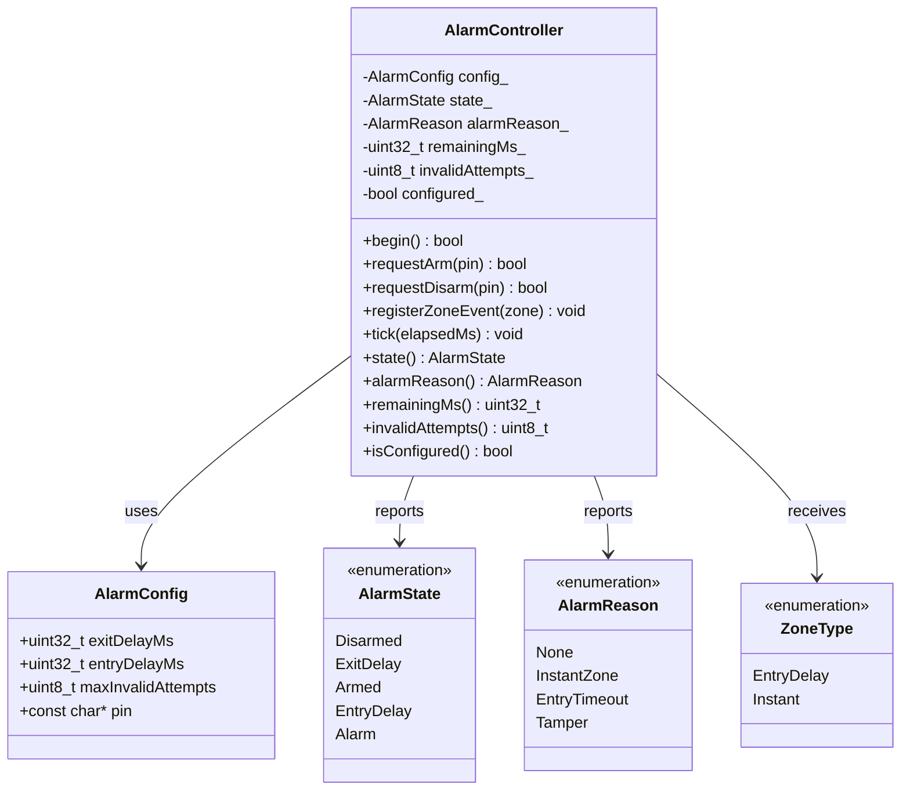

# Diagrama de clases UML

El siguiente diagrama resume el dominio implementado. Se usa Mermaid para que el diagrama sea versionable junto con el codigo.

## Relacion con el modelo de dominio

- `AlarmController` concentra la maquina de estados verificable.
- `AlarmConfig` representa parametros acordados durante instalacion.
- `ZoneType` abstrae el origen fisico del evento.
- `AlarmReason` conserva evidencia del motivo de disparo para diagnostico.
